# Dev_menu_jeux — Plateforme de mini-jeux en console (C++)

> SAE Développement — BUT Informatique
> Auteur principal : **Bardoux Théo** · Équipe : Condamine Thibault, Morin Warren

Le but de ce projet était de développer une plateforme console regroupant plusieurs mini-jeux accessibles depuis un menu unique. J'ai réalisé l'infrastructure commune du projet : un menu auto-extensible, un système d'affichage TUI séparant les rendus ASCII de la logique du programme, un système de cache pour optimiser les affichages, ainsi que le noyau du jeu de cartes, le jeu The War, la saisie sécurisée et la compatibilité Windows.


---

## Sommaire

- [Dev\_menu\_jeux — Plateforme de mini-jeux en console (C++)](#dev_menu_jeux--plateforme-de-mini-jeux-en-console-c)
  - [Sommaire](#sommaire)
  - [Aperçu](#aperçu)
  - [Fonctionnalités](#fonctionnalités)
  - [Architecture](#architecture)
    - [Boucle de jeu — "The War"](#boucle-de-jeu--the-war)
  - [Ma contribution vs. le travail d'équipe](#ma-contribution-vs-le-travail-déquipe)
  - [Choix techniques et pertinence](#choix-techniques-et-pertinence)
    - [1. Registre global de jeux par auto-enregistrement statique](#1-registre-global-de-jeux-par-auto-enregistrement-statique)
    - [2. Moteur TUI basé sur un cache de sections](#2-moteur-tui-basé-sur-un-cache-de-sections)
    - [3. Les cartes comme clé texte (`"14S"`, `"7H"`)](#3-les-cartes-comme-clé-texte-14s-7h)
    - [4. Main du joueur : `unordered_map` + `vector` en parallèle](#4-main-du-joueur--unordered_map--vector-en-parallèle)
    - [5. `secure_cin<T>` : abstraction de saisie](#5-secure_cint--abstraction-de-saisie)
    - [6. Compatibilité console Windows isolée dans un module dédié](#6-compatibilité-console-windows-isolée-dans-un-module-dédié)
    - [7. Paramètres de jeu encapsulés (statiques + accesseurs)](#7-paramètres-de-jeu-encapsulés-statiques--accesseurs)
    - [8. Garde-fou anti-boucle infinie](#8-garde-fou-anti-boucle-infinie)
  - [Limites connues et pistes d'amélioration](#limites-connues-et-pistes-damélioration)
  - [Compilation et exécution](#compilation-et-exécution)
  - [Utilisation](#utilisation)
  - [Structure du dépôt](#structure-du-dépôt)
  - [Documentation](#documentation)
  - [Crédits](#crédits)

---

## Aperçu

Au lancement, le programme affiche un menu principal en ASCII art (Play / Settings / Credits / Exit). Chaque jeu enregistré s'affiche automatiquement dans la liste "Play" sans qu'aucune ligne du menu n'ait besoin d'être modifiée pour l'accueillir.

```
1. Play        →  liste des jeux enregistrés (auto-détectés au démarrage)
2. Settings    →  réglages globaux
3. Credits     →  Maelstrom studio — Bardoux Théo, Condamine Thibault, Morin Warren
4. Exit
```

Le jeu de cartes **"The War"** (bataille), que j'ai entièrement implémenté, illustre le pipeline complet : distribution aléatoire, tours automatisés (ou manuels pour le joueur 1), affichage ASCII des cartes côte à côte, gestion des égalités, transfert des cartes au gagnant, condition de victoire et classement final.

## Fonctionnalités

- **Menu multi-jeux extensible** : les jeux s'ajoutent au menu par auto-enregistrement, sans toucher au code du menu.
- **Jeu de cartes complet ("The War")** :
  - deck de 32 ou 52 cartes, distribution aléatoire équitable ;
  - mode automatique (IA simple) ou mode manuel pour le joueur 1 ;
  - 2 ou 4 joueurs ;
  - règle optionnelle *"hyper two"* ;
  - classement final trié par nombre de cartes.
- **Moteur TUI (Text User Interface)** :
  - cache de sections de fichiers texte pour un affichage ASCII rapide ;
  - affichage horizontal pour juxtaposer plusieurs cartes ASCII ;
  - couleurs ANSI et effacement d'écran portables.
- **Saisies utilisateur sécurisées** (`secure_cin`) : plus de boucle infinie sur une saisie invalide.
- **Compatibilité console Windows** : activation des couleurs ANSI et de l'UTF-8 sur `cmd.exe`/PowerShell, sans effet (et sans erreur) sur Linux/macOS.
- **Documentation Doxygen** générée à partir des commentaires du code (`Doxyfile` fourni, `EXTRACT_ALL` activé).

## Architecture

Le projet s'articule autour d'un noyau générique (que j'ai conçu) sur lequel viennent se greffer les jeux, chacun étant une unité de compilation indépendante.


**Principe clé :** chaque fichier de jeu déclare un objet statique qui s'enregistre auprès du registre global au chargement du programme (voir plus bas). Le fichier `menu.cpp`, qui contient `main()`, n'a donc **jamais besoin d'être modifié** pour ajouter un jeu — condition nécessaire : tous les fichiers doivent être compilés dans le même exécutable.

### Boucle de jeu — "The War"



## Ma contribution vs. le travail d'équipe

Ce projet a été réalisé en équipe (3 personnes, "Maelstrom studio"). **Les fichiers présentés dans ce README et détaillés ci-dessous sont les miens** : `menu.cpp/.h`, `TUI-Engine--Prequel.cpp/.h`, `Card_core.cpp/.h`, `card_game_-_the_war.cpp`, `secure_cin.hpp`, `Set_windows_settings.cpp/.h`. Mes camarades (Condamine Thibault, Morin Warren) ont développé leurs propres jeux (`Chifoumi.cpp`, `pendu.cpp`, `morpion.cpp`) en s'appuyant sur l'infrastructure commune (menu, TUI, saisie sécurisée) que j'ai fournie — ce qui, en soi, a validé que l'architecture était suffisamment générique pour être réutilisée par d'autres sans modification.

## Choix techniques et pertinence

### 1. Registre global de jeux par auto-enregistrement statique
Chaque jeu s'inscrit via un objet statique construit au chargement du programme :
```cpp
struct register_Cardgame__the_war {
    register_Cardgame__the_war() { addGame("Card game: the war", the_war_Menu); }
};
static register_Cardgame__the_war registerGameInstance;
```
**Pertinence :** le menu central (`menu.cpp`) n'a aucune dépendance vers les jeux — il ne connaît que l'interface `game { name, launchFunction }`. On peut ajouter, retirer ou modifier un jeu sans toucher au noyau : c'est le pattern classique de *registre* / *plugin léger*, particulièrement adapté à un travail d'équipe où chacun développe son fichier indépendamment.

### 2. Moteur TUI basé sur un cache de sections
L'ASCII art (cartes, logos, menus) est stocké dans des fichiers texte découpés en sections (`===14S===`, `===Menu===`...). `TUI_Cache` lit un fichier une seule fois et garde les sections en mémoire (`unordered_map<KeyStructure, vector<string>>`) ; les affichages suivants ne relisent plus le disque.
Cela découple totalement le contenu visuel (fichiers `.txt` éditables sans recompiler) de la logique de jeu, et évite de recomposer les mêmes gros blocs ASCII à chaque tour — un vrai souci de performance identifié pendant le développement (cf. compte-rendu, section 3).

### 3. Les cartes comme clé texte (`"14S"`, `"7H"`)
Une carte est identifiée par une chaîne `valeur + couleur` (via `Card::make_key`).
Cette clé sert à la fois d'identifiant unique pour les `unordered_map` (deck, main, table) *et* de nom de section pour retrouver directement le bon dessin ASCII dans le fichier de cartes. Une seule donnée fait le pont entre la logique du jeu et son rendu visuel — pas de table de correspondance à maintenir en double.

### 4. Main du joueur : `unordered_map` + `vector` en parallèle
`Player` garde ses cartes à la fois dans une map (accès O(1) par clé, utile en mode manuel où le joueur choisit une carte précise) et dans un vector (ordre d'affichage et de tirage FIFO pour l'IA).
C'est un compromis classique et pertinent lecture rapide / ordre logique — au prix d'une double tenue à jour (ajouter/retirer une carte touche les deux structures).

### 5. `secure_cin<T>` : abstraction de saisie
Un template générique enrobe `std::cin >>`, détecte l'échec (`cin.fail()`), vide le buffer et redemande une valeur — avec un flag global pour désactiver le mode "retry" si besoin.
Il permet d'éviter une classe de bugs très fréquente chez les débutants (boucle infinie sur une entrée non numérique), tout en restant générique (`template<typename T>`) et réutilisable telle quelle dans n'importe quel jeu du projet.

### 6. Compatibilité console Windows isolée dans un module dédié
`Set_windows_settings` active `ENABLE_VIRTUAL_TERMINAL_PROCESSING` et le code page UTF-8, entièrement encadré par `#ifdef _WIN32`.
Le reste du code peut utiliser des couleurs ANSI et des accents sans se soucier de la plateforme. Sur Linux/macOS ces fonctions ne font simplement rien, ce qui a été vérifié : le projet **compile et s'exécute sans modification sur Linux**.

### 7. Paramètres de jeu encapsulés (statiques + accesseurs)
Le nombre de joueurs, le mode manuel et la règle spéciale sont chacun protégés par un couple getter/setter (`Set_nb_player`/`Get_nb_player`, etc.) plutôt qu'exposés en variables globales brutes.
Cela centralise la validation (`Set_nb_player` n'accepte que 2 ou 4) et documente clairement l'intention — au prix d'un état global implicite, discuté ci-dessous.

### 8. Garde-fou anti-boucle infinie
La boucle de rounds est plafonnée à `MAX_ROUNDS = 100000` : ainsi les bugs de transfert de cartes, égalité perpétuelle ou autre ne peuvent pas geler le programme.

## Limites connues et pistes d'amélioration

En toute transparence, voici les points que je retravaillerais :

- **Règle spéciale "hyper two" incohérente avec sa description.** Le texte d'aide annonce *"le 2 ne bat que l'As, l'As ne perd que contre le 2"*, mais l'implémentation (`return 100 + c.value` pour un 2) rend le 2 supérieur à toutes les cartes, pas seulement à l'As. À corriger si l'on veut respecter la règle telle qu'annoncée au joueur.
- **Rechargement = duplication.** Si `preload`/`display` est appelé deux fois sur la même section sans `erase()` intermédiaire, `TUI_Cache::load` **ajoute** les lignes à la suite des lignes existantes au lieu de les remplacer — un `erase` explicite ou une politique "replace" seraient plus sûrs.
- **Couplage logique/affichage dans `Play_the_war`.** La boucle de jeu mélange calcul (qui gagne le tour), affichage (`cout`, rendu ASCII) et lecture clavier dans la même fonction, ce qui la rend difficile à tester unitairement. Séparer un "moteur" pur (sans I/O) du "présentateur" faciliterait les tests automatisés.
- **État global implicite.** Les réglages (`g_special_rules`, `g_manual_mode`, la statique dans `Set_nb_player`) vivent en dehors de toute classe. Fonctionnel pour un programme mono-thread, mais ce sont des variables cachées qu'un futur jeu multi-parties simultanées ne pourrait pas réutiliser telles quelles.
- **Dépendance à des chemins relatifs.** Les fichiers ASCII sont référencés en dur (`"ascii_art/En/Art/cartes_ascii.txt"`) : l'exécutable doit être lancé depuis la racine du projet, sinon les rendus échouent silencieusement (le `cerr` d'erreur de `load()` est facile à manquer dans le flux de jeu).
- **Aucun test automatisé.** La logique (comparaison de cartes, distribution, victoire) est simple à isoler et gagnerait à être couverte par quelques tests unitaires (ex. Catch2 ou GoogleTest).
- **Détail mineur :** `Distribute()` compare un `int` et une `size_t` (`i < players.size()`), ce que le compilateur signale (`-Wsign-compare`) — sans conséquence ici vu la taille des vecteurs, mais à corriger par propreté.

## Compilation et exécution

Le projet ne fournit pas encore de système de build (CMake/Makefile) ; il se compile directement avec `g++` (testé avec succès sous g++ 13, Ubuntu, et fonctionne également sous Windows avec MinGW/MSVC) :

```bash
g++ -std=c++17 -O2 -o game \
    menu.cpp Card_core.cpp card_game_-_the_war.cpp \
    TUI-Engine--Prequel.cpp Set_windows_settings.cpp \
    Chifoumi.cpp pendu.cpp morpion.cpp

./game        # Linux / macOS
game.exe      # Windows
```

Lancez l'exécutable **depuis la racine du dépôt** (là où se trouve le dossier `ascii_art/`), sinon les rendus ASCII ne se chargeront pas.

## Utilisation

1. Au lancement, choisissez **1. Play** pour voir la liste des jeux enregistrés.
2. Sélectionnez **Card game: the war**, puis **1. Play** pour lancer une partie (2 joueurs par défaut).
3. Dans **2. Settings**, ajustez le nombre de joueurs (2 ou 4), activez le mode manuel pour contrôler le joueur 1, ou activez la règle spéciale "hyper two".
4. La partie se déroule automatiquement tour par tour (Entrée pour avancer) jusqu'à ce qu'un joueur récupère toutes les cartes.

## Structure du dépôt

```
.
├── menu.cpp / menu.h                     # Registre des jeux + main()
├── TUI-Engine--Prequel.cpp / .h          # Moteur d'affichage ASCII + cache
├── Card_core.cpp / .h                    # Deck / Player / Table (noyau cartes)
├── card_game_-_the_war.cpp               # Jeu "The War" (implémentation complète)
├── secure_cin.hpp                        # Saisie utilisateur sécurisée
├── Set_windows_settings.cpp / .h         # Compatibilité console Windows
├── Chifoumi.cpp / pendu.cpp / morpion.cpp# Jeux développés par l'équipe
├── ascii_art/                            # Fichiers texte source des rendus ASCII
├── Doxyfile                              # Configuration Doxygen
└── Compte rendus/                        # Comptes-rendus individuels (PDF/DOCX/ODT)
```

## Documentation

Une documentation Doxygen complète est générée à partir des commentaires du code (`EXTRACT_ALL` activé pour couvrir l'ensemble des sources même partiellement documentées) :

```bash
doxygen Doxyfile
# Sortie dans docs/doxygen/html/index.html
```

## Crédits

Projet réalisé dans le cadre d'une SAE Développement (BUT Informatique) par **Maelstrom studio** :

- **Bardoux Théo** — développeur principal : architecture globale, menu, moteur TUI, noyau de cartes, jeu "The War", saisie sécurisée, compatibilité Windows.
- **[Condamine Thibault](https://renardoh58.github.io/portfolio/)** — jeu Chifoumi.
- **Morin Warren** — jeu Pendu.